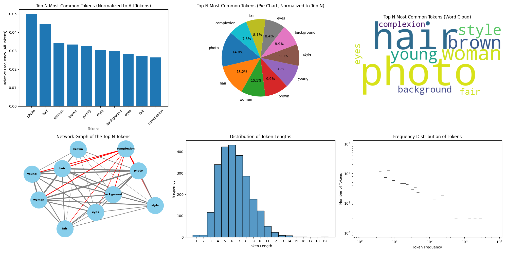

# Visualize-DataSet-Captions
A simple Python script I wrote to test my regularization dataset captions -- built with the help of GPT-4o -- which combs through a dataset folder and analyzes the caption TXT files therein. Information about the distribution/frequency of the words/tokens is then diplayed using bar charts, a pie chart, word cloud, length histogram, and a frequency distribution. An output TXT with listed token counts is also generated during the process. Feel free to use, share, and modify this script to suit your needs. 
<(˶ᵔᵕᵔ˶)>



## Table of Contents

- [Changelog](#changelog)
- [Installation](#installation)
- [Usage](#usage)
- [Contributing](#contributing)
- [License](#license)
- [Acknowledgments](#acknowledgments)

## Changelog

### [2.1] - 12/10/2024
A few small changes to improve the user experience.

### Added
- New install BAT to set up local venv and create `captions` folder.
- New run BAT to use script and activate venv.

### Changed
- Main script now uses the local `captions` folder to look for the TXT files. Should still be able to keep images and captions together.

### [2.0] - 7/22/2024

#### Removed 
 - One Bar chart as it contained redundant information already present in the pie chart.

#### Added 
 - Network Graph of the Top N Tokens to highlight co-occurences within the Top N tokens.

#### Fixed
 - Chart titles/labels that were not correct
 - Expanded comments in python script for user convenience and clarity

### [1.0] - 7/20/2024
_First release._

## Installation

1. Please have Python 3.7, or later, installed. You can download it from [python.org](https://www.python.org/downloads/).

2. Clone the repository and go into the created folder:
    ```sh
    git clone https://github.com/klromans557/Visualize-DataSet-Captions.git
    cd Visualize-DataSet-Captions
    ```

3. Install the required dependencies:
   - Use the provided `install_VDC.bat`, which also makes caption folder

   OR
   
    ```sh
    pip install -r requirements.txt
    ```
    - and make a caption folder yourself
   
4. The script can handle the images and captions being in the same folder, feel free to keep them together.

## Usage

To run the script and visualize the captions, follow these steps:

1. (Optional) Update the variables at the top of the script. However, the defaults work fine in most cases:
   - The `exlude_list` has been populated with common words, but feel free to change these.
   - Set the `num_loaders` based on number of CPU cores/threads to use in parallel processing.
   - Set the `top_n` value to change the number of top N tokens used in graph calculations.
   - Set the `network_index` to select which of the top N token nodes to emphasize in network graph.
     * e.g., most common: = 1, least common: = top_n
   - Change `output_file` text for the name of the output TXT file with token counts.
     * note: this file is created in the same directory as the script when run, default to 'token_counts'

3. Place captions in `captions` folder. Run the script using the included BAT file or double-click the py file.

4. If the `token_counts.txt` file already exists, the script will skip the token counting step and proceed to the graphs. Keep in mind that if you change any of your dataset TXT files that you will need to delete/re-name this file and re-run the script.

5. The script will display the following graphs:
    - A bar charts showing the relative frequency of the top N tokens (normalized to all tokens).
    - A pie chart showing the relative frequency of the top N tokens (normalized to top N tokens).
    - A word cloud of the top N tokens.
    - A network graph of the co-occurrences in the top N tokens.
    - A histogram of token lengths.
    - A frequency distribution plot of token frequencies.

6. Close the terminal windows to exit the script.

7. EXTRA Batch Caption Prompt: Check out the bottom of my Civitai article for information, [here](https://civitai.com/articles/6264/a-simple-script-for-visualizing-captions-in-large-datasets).

## Contributing

(NOTE: I'm new to sharing through GitHub, and this is just the standard template for this section)

Contributions are welcome! If you have any suggestions, improvements, or bug fixes, please follow these steps:

1. Fork the repository.
2. Create a new branch with a descriptive name (`git checkout -b my-feature-branch`).
3. Make your changes and commit them (`git commit -m 'Add some feature'`).
4. Push to the branch (`git push origin my-feature-branch`).
5. Open a pull request.

Please ensure your code adheres to the existing style and includes appropriate tests.

### Reporting Issues

If you find a bug or have a feature request, please create an issue [here](https://github.com/klromans557/Visualize-DataSet-Captions/issues).

## License

This project is licensed under the MIT License - see the [LICENSE](LICENSE) file for details.

## Acknowledgments

- [OpenAI](https://www.openai.com) for providing guidance and assistance in developing this project.
- [GitHub](https://github.com) for hosting the repository.
- [Dr. Furkan Gözükara](https://www.patreon.com/SECourses/posts) for sharing his scripts through the SECourses Patreon, associated Discord server and YouTube channel.
  These resources were invaluable to me during the development of this project and served as guides/templates for creating such scripts.
